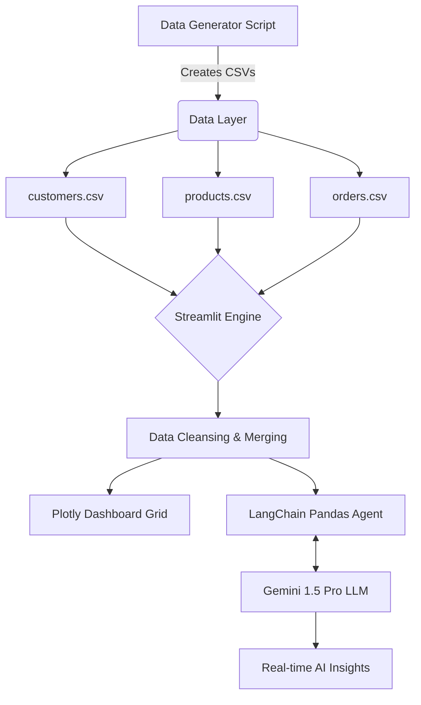

# 🔮 Nexus Analytics: Enterprise AI-Powered Data Warehouse & Dashboard


## 📖 Overview
Nexus Analytics is a full-stack, enterprise-grade data platform that bridges the gap between traditional Business Intelligence (BI) and Generative AI. 

Instead of relying on static reports, Nexus dynamically simulates a multi-table relational data warehouse (Customers, Products, Orders), visualizes high-level executive KPIs in a dense grid layout, and features a **LangChain-powered AI Data Scientist** capable of executing Python code on the raw dataset in real-time.

## ✨ Key Enterprise Features

* **Multi-Table Relational Data Engine**: Simulates a real-world SQL-style schema to calculate complex financial metrics like Customer Acquisition Cost (CAC) and Lifetime Value (LTV).
* **Actionable RFM Segmentation**: Machine-learning adjacent Recency, Frequency, and Monetary (RFM) modeling to categorize customers into *Whales*, *Core Loyalists*, and *At-Risk Churn*.
* **Cohort Retention Heatmaps**: Advanced month-over-month triangle heatmaps to visualize user drop-off and retention curves visually.
* **Profitability & Predictive Forecasting**: Tracks true net profit margins by product category and uses rolling averages to project future revenue trends.
* **Embedded AI Data Scientist**: An interactive Gemini 1.5 Pro agent powered by LangChain's Pandas DataFrame agent. It writes and executes Python on the fly to answer complex mathematical queries that aren't natively visible on the dashboard.

## 🏗️ System Architecture



## 📂 Project Structure
```text
📦 nexus-analytics
 ┣ 📜 app.py                  # Main Streamlit dashboard & AI agent logic
 ┣ 📜 generate_data.py        # Synthetic relational data warehouse generator
 ┣ 📜 requirements.txt        # Python dependencies
 ┣ 📜 .env                    # Environment variables (API Keys)
 ┣ 📜 .gitignore              # Git ignore rules
 ┗ 📜 README.md               # Project documentation
```

## 🚀 Quick Start Guide

### 1. Clone the Repository
```bash
git clone https://github.com/sandeep-kumar-270904/Data-analatics-.git
cd Data-analatics-
```

### 2. Environment Setup
Create a `.env` file in the root directory and add your Google Gemini API Key:
```env
GEMINI_API_KEY="your_api_key_here"
```

### 3. Install Dependencies
It is recommended to use a virtual environment.
```bash
pip install -r requirements.txt
```

### 4. Generate the Data Warehouse
Run the data engine to generate the 5,000+ relational transactions:
```bash
python generate_data.py
```

### 5. Launch the Platform
Start the Streamlit server:
```bash
streamlit run app.py
```
Navigate to `http://localhost:8501` in your browser.

## 🔮 Future Roadmap
- [ ] **Dockerization**: Package the app into a Docker container for seamless cross-platform deployment.
- [ ] **Database Integration**: Swap out CSV generation for a live PostgreSQL or Snowflake connection.
- [ ] **CI/CD Pipeline**: Implement GitHub Actions for automated linting, testing, and deployment to Streamlit Community Cloud.

---
*Designed and built with modern data engineering & GenAI principles.*
